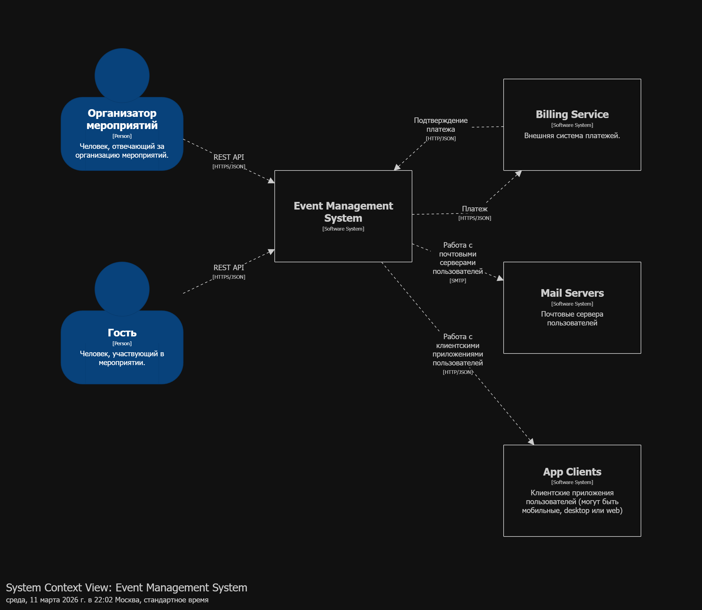
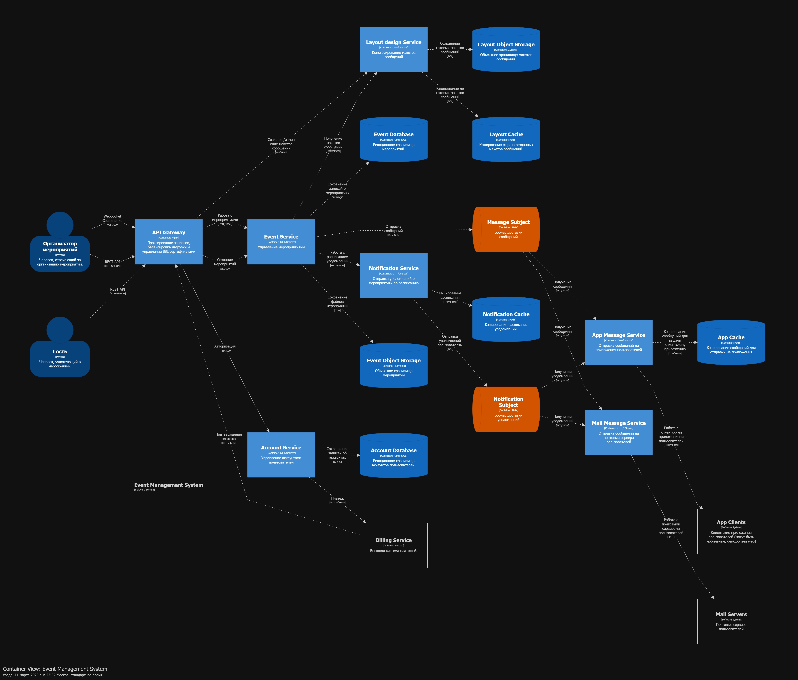
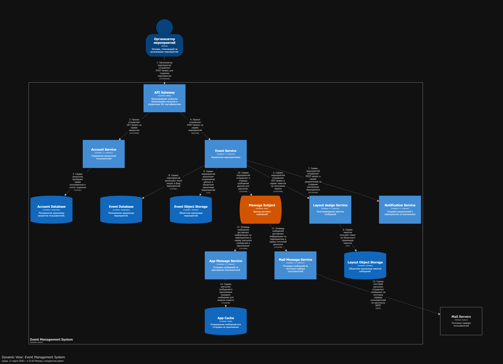

# Домашнее задание 01

## Документирование архитектуры в Structurizr

### Вариант №3 — Сайт конференции (аналогичный https://www.eventboost.com/ru-RU/)

### Выполнил студент группы М8О-106СВ-25 Павлов Иван Дмитриевич

## 1. Описание выбранного варианта

Разрабатывается система управления мероприятиями, позволяющая:

* создавать и настраивать конференции;
* управлять списками гостей;
* отправлять приглашения и уведомления;
* формировать макеты писем, билетов и бейджей;
* поддерживать платный и бесплатный вход;
* обеспечивать мобильную поддержку гостей;
* формировать отчетность.

---

## 2. Роли пользователей и внешние системы

### Роли пользователей

**1. Организатор**

* Регистрируется и оплачивает подписку
* Создает мероприятия
* Управляет списками гостей
* Отправляет приглашения и сообщения
* Настраивает расписание
* Получает отчеты

**2. Гость**

* Принимает или отклоняет приглашение
* Покупает билет (если мероприятие платное)
* Получает уведомления
* Добавляет спутников (если разрешено)
* Использует мобильное приложение для участия

---

### Внешние системы

1. **Платежная система (Billing Service)**
   Используется для оплаты подписки организатора и билетов.

2. **Почтовые серверы пользователей (Mail Servers)**
   Используются для отправки приглашений, уведомлений и билетов.

3. **Клиентские приложения (App Clients)**
   Мобильные / web / desktop-клиенты гостей.

---

## 3. Диаграмма System Context (C1)

В контексте система:

* Принимает запросы от Организатора и Гостя через API Gateway
* Взаимодействует с Billing Service для проведения платежей
* Отправляет письма через Mail Servers
* Отправляет сообщения в клиентские приложения

Система выступает как центральная платформа управления мероприятиями.

---

## 4. Основные Use Cases

### Организатор

* Регистрация и авторизация
* Оплата подписки
* Создание мероприятия
* Настройка расписания
* Импорт гостей
* Отправка приглашений
* Управление шаблонами сообщений
* Просмотр отчетности

### Гость

* Получение приглашения
* Подтверждение участия
* Покупка билета
* Получение QR-кода
* Использование мобильного приложения
* Добавление спутников

---

## 5. Контейнерная архитектура (C2)

Система реализована в виде набора контейнеров (микросервисная архитектура).

### Инфраструктурный слой

* **API Gateway (Nginx)**
  SSL termination, проксирование, маршрутизация, балансировка.

---

### Бизнес-сервисы

* **Account Service**
  Управление пользователями, проверка подписки, интеграция с биллингом.

* **Event Service**
  Создание и управление мероприятиями, расписанием, файлами.

* **Layout Design Service**
  Создание шаблонов писем, билетов, бейджей.

* **Notification Service**
  Управление расписанием уведомлений.

* **Mail Message Service**
  Отправка email-сообщений.

* **App Message Service**
  Доставка сообщений в мобильные клиенты.

---

### Хранилища данных

* Event Database (PostgreSQL)
* Account Database (PostgreSQL)
* Event Object Storage (S3/MinIO)
* Layout Object Storage (S3/MinIO)

---

### Кэширование

* Layout Cache (Redis)
* Notification Cache (Redis)
* App Cache (Redis)

---

### Брокеры сообщений

* Message Subject (NATS)
* Notification Subject (NATS)

Использование брокеров обеспечивает:

* Асинхронную доставку сообщений
* Декуплинг сервисов
* Повышение устойчивости

---

## 6. Взаимодействие контейнеров

### Синхронные взаимодействия

* Gateway → Account Service (авторизация)
* Gateway → Event Service (CRUD мероприятий)
* Event Service → Notification Service (создание расписания)
* Event Service → Layout Design Service (получение шаблонов)

Протокол: HTTPS/JSON.

---

### Асинхронные взаимодействия

* Event Service → Message Subject
* Notification Service → Notification Subject
* Broker → Mail Service / App Service

Протокол: TCP/JSON через NATS.

Это позволяет:

* не блокировать пользовательские операции;
* масштабировать сервисы рассылки независимо;
* повторно доставлять сообщения при сбоях.

---

## 7. Dynamic диаграмма (архитектурно значимый сценарий)

### Сценарий: Создание мероприятия

Последовательность:

1. Организатор отправляет POST-запрос через Gateway.
2. Gateway проверяет права через Account Service.
3. Account Service валидирует подписку в Account DB.
4. Gateway передает запрос в Event Service.
5. Event Service:

   * получает макет из Layout Design Service,
   * создает расписание через Notification Service,
   * сохраняет данные в Event DB,
   * сохраняет файлы в Object Storage,
   * публикует событие в Message Subject.
6. Message Subject доставляет сообщение:

   * в Mail Service,
   * в App Service.
7. Mail Service отправляет письма через SMTP.
8. App Service кэширует сообщение для мобильных клиентов.

Это сценарий архитектурно значимый, так как:

* затрагивает большинство сервисов;
* включает синхронные и асинхронные взаимодействия;
* демонстрирует проверку подписки;
* включает публикацию доменного события.

---

## 8. Выбор технологий

| Контейнер           | Технология    |
| ------------------- | ------------- |
| API Gateway         | Nginx         |
| Backend сервисы     | C++ / Userver |
| Базы данных         | PostgreSQL    |
| Объектное хранилище | S3 / MinIO    |
| Кэш                 | Redis         |
| Брокер сообщений    | NATS          |
| Email               | SMTP          |
| API                 | HTTPS/JSON    |

---

## 9. Результат работы в картинках

