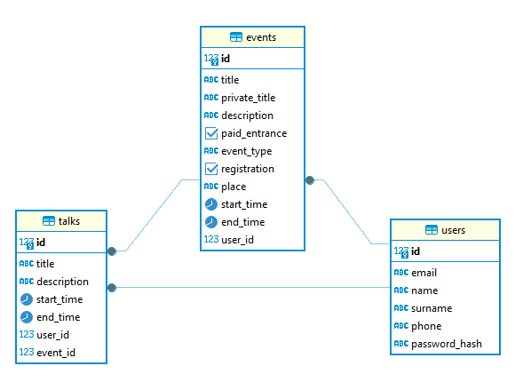

# Домашнее задание 03

## Проектирование и оптимизация реляционной базы данных

Вариант №3: сайт конференции (PostgreSQL + userver)

### Выполнил студент группы М8О-106СВ-25 Павлов Иван Дмитриевич

### 1. Проектирование схемы базы данных

В предложенном варианте для перевода приложения из ЛР №2 на PostgreSQL необходимы 3 сущности: Пользователь, Доклад и Конференция. 

Графическое представление схемы БД:



- Для каждой сущности определено по таблице, соответственно как и в in-memory БД;
- В качестве первичных ключей были добавлены id типа BIGSERIAL - автоинкрементирующегося BIGINT;
- Так как сущность Talk зависит от Event и User, добавляются внешние ключи event_id и user_id с защитой restrict при удалении: если пользователь создал доклад, такого пользователя удалить нельзя. Если доклад входит в конференцию, то конференцию удалить нельзя. На UPDATE ставится правило NO ACTION, так как id иммутабельны;
- Типы данных для колонок - BIGSERIAL для id, TEXT для строковых, BIGINT для внешних ключей, TIMESTAMPTZ для дат и BOOLEAN для флагов;
- Ограничения UNIQUE на email и phone у юзера, ограничения CHECK на наличие "@" в email, паттерна мобильного телефона на phone, значений из enum для event_type и на длину строки для текстовых полей. Ограничение NOT NULL было применено ко всем полям, где по openapi-схеме они были required (для не required полей применены дефолтные значения, либо NULL).

### 2. Создание базы данных

- Использован официальный образ postgres:16 из dockerhub, конфигурация в [docker-compose.yaml](docker-compose.yaml);
- Создание таблиц описано в файле [schema.sql](schema.sql);
- Небольшой набор тестовых данных в файле [data.sql](data.sql).

### 3. Создание индексов

Индексы также находся в файле  [schema.sql](schema.sql);

Частые операции:
- Поиск пользователя по логину (`users.email`);
- Поиск пользователей по маске имени/фамилии (`users.name`, `users.surname`);
- Получение докладов конференции (`talks.event_id`);
- Добавление доклада в конференцию (`talks.id`, `talks.event_id`).

Добавленные индексы и зачем они нужны:
- `idx_users_email` - ускоряет поиск пользователя по логину/email;
- `idx_users_name_surname` - ускоряет поиск по маскам имени/фамилии;
- `idx_events_user_id` - ускоряет выборки конференций пользователя и JOIN по FK;
- `idx_events_start_time` - ускоряет фильтрацию/сортировку конференций по времени;
- `idx_talks_event_id` - ускоряет выборку докладов в конференции;
- `idx_talks_user_id` - ускоряет выборки докладов автора;
- `idx_talks_event_time` - ускоряет выборку докладов конференции с сортировкой по времени.

### 4. Оптимизация запросов

- SQL запросы из моего варианта находятся в файле [queries.sql](queries.sql);
- Дальнейшая работа над этим пунктом описана в файле [optimization.md](optimization.md).

### 5. Подключение API к базе данных

Так как в прошлом варианте был использован DI на основе компонентов Userver, вся реализация Postgres была спрятана за интерфейсом и находится в директории [postgrers](src/infrastructure/postgres). Был использован userver/storages/postgres/cluster.hpp и userver::components::Postgres в [main](src/main.cpp) файле.

### 6. Результат

- `schema.sql` - [schema.sql](schema.sql)
- `data.sql` - [data.sql](data.sql)
- `queries.sql` - [queries.sql](queries.sql)
- `optimization.md` - [optimization.md](optimization.md)
- `README.md` - [README.md](README.md)
- Dockerfile - [Dockerfile](Dockerfile), docker-compose.yaml - [docker-compose.yaml](docker-compose.yaml)

### 7. Запуск

```
docker-compose up
```